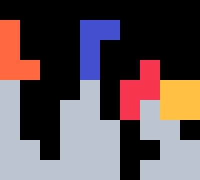
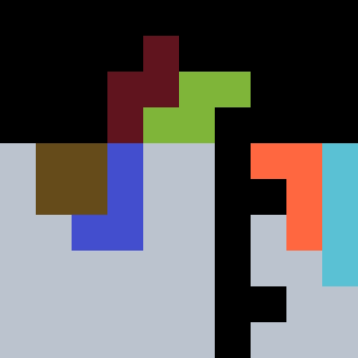

{width=200px}

# Butterfly

Butterfly is a streamlined _TSD &rarr; 2xTST_ opener. It was discovered January 2025. 

## 1st Bag {#bag-1}

{width=150px}

This can be stacked with $43.49 \%$ of bags. With the mirrored setup, the probability rises to $53.33 \%$.

## 2nd Bag {#bag-2}

{width=150px}

This build covers $95.00 \%$ of bags with the t-spin, and $98.33 \%$ without. For specific queues, an $I$-spin and/or an $S$-tuck is needed. To perform the $I$-spin, tuck the piece and rotate clockwise once as shown below.

{width=150px}

::: warning
In the mirrored build, the $I$-spin can be performed on [tetr.io](https://tetr.io/) but not [jstris](https://jstris.jezevec10.com/).
:::

## 3rd Bag {#bag-3}

There are only [two builds](https://knewjade.github.io/fumen-for-mobile/#?d=v115@OgQ4BeAtFeR4BtGeQ4AtDeA8Rpg0B8AehlwhA8Rpg0?B8BeglwhB8h0B8AeA8glwhF8AeB8whF8BeH8AeC8JeAgWjA?CAfeEFc/CE5oo2AT7STAS4sdDnoo2AtOJ5DtikTASomAAOg?wDIexDFeh0Q4GeQpAtwhGeQpAewSHexSteAgWjACAfeEFc/?CE5oo2AT7STAS4sdDnoo2AtOJ5DtikTAS4oAA) required to achieve total coverage. The most practical solution set, however, has three easy solutions covering $100 \%$ of queues. Each solution corresponds to whichever of $O, Z, J$ comes first &ndash; the remaining two pieces can always be placed in the same manner.

  
  
  

$I, L, S$ have the same placement across all solutions.

::: tip
Because the solutions overlap in coverage, the user may be able to opt for different solutions to reach an existing garbage well.
:::
