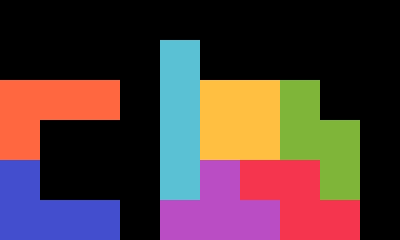
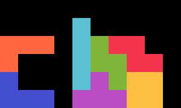
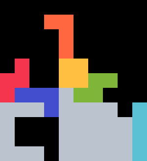
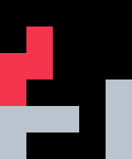
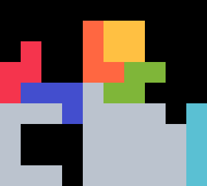
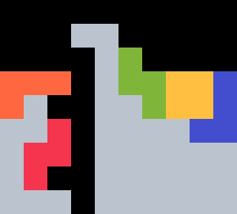
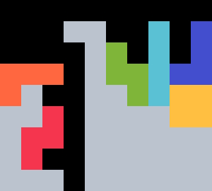
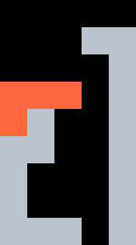
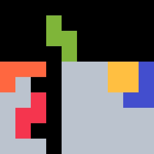
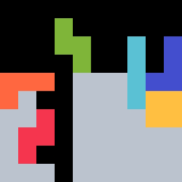

{width=200px}

# Cockroach

Cockroach is an unorthodox _TSD -> 2xTST Tower_ opener. It was discovered April 2024. 

## 1st Bag {#bag-1}

{width=150px}

This shape can be stacked with $62.54 \%$ of bags. With the mirrored setup, the probability rises to $82.06 \%$. There are _two ways_ to stack this bag due to the congruent $O, S, Z$ shape.

::: details
With mirror, Cockroach and [TLT](../tlt) cover all possible queues for the first bag.
:::

## 2nd Bag {#bag-2}

The user can always stack in one of two ways depending on the relative order of the $L$ and $O$ pieces.

#### Preferred route {#bag-2-good}

{width=150px}

This build is preferred as it leads to _better coverage_ in the third bag. It can be stacked with $71.43 \%$ of queues. For specific queues, an easy $J$-spin is needed:

{width=75px}

#### Alternate route {#bag-2-alt}

{width=150px}

The other build is better.

## 3rd Bag {#bag-3}

The full *2xTST Tower* can be stacked with $97.62 \%$ of queues, assuming the user prioritizes the [preferred route](./#bag-2-good).

#### Preferred route {#bag-3-good}

The following two builds cover all bags.

  
  

For specific queues, a $Z$-spin is needed:

{width=75px}

#### Alternate route {#bag-3-alt}

The following two builds cover $91.67 \%$ of bags.

  
  

