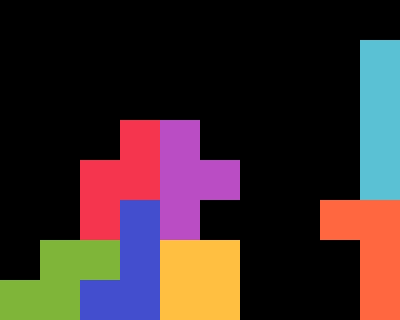
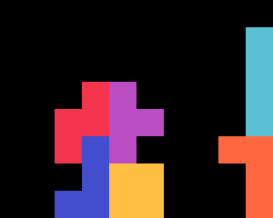

{width=200px}

# DB Cannon

DB Cannon is a reliable _TSD -> 2xTST Tower_ opener. It was discovered May 2024. 

## 1st Bag {#bag-1}

{width=150px}

This shape can be stacked with $56.51 \%$ of bags. With the mirrored setup, the probability rises to $71.11 \%$.

## 2nd Bag {#bag-2}

{width=150px}

This build works for any queue, but may require an $S$-tuck with rotations, as shown below.

{width=150px}

## 3rd Bag {#bag-3}

There are three minimal solutions covering every possible queue.

  
  
  

Note that $L, Z$ have the same placement across all solutions.
