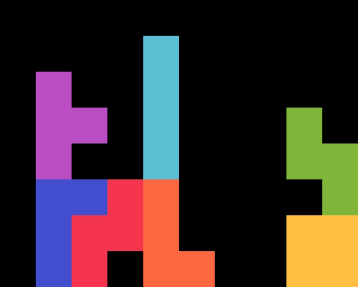
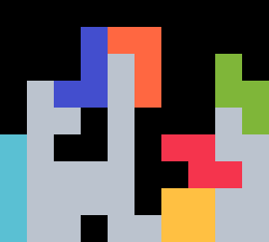
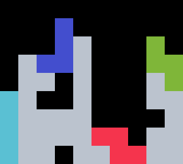
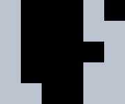
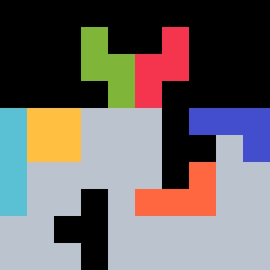
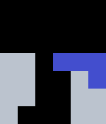
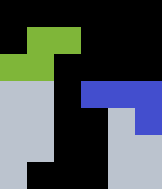

{width=200px}

# Gemini <Badge type="warning" text="requires 180"/> <Badge type="danger" text="BM"/>

Gemini is an audacious _(TSD) -> TST -> TST_ opener. It was discovered February 2025.

## 1st Bag {#bag-1}

{width=150px}

This shape can be stacked with $45.24 \%$ of bags. With the mirrored setup, the probability rises to $66.35 \%$.

## 2nd Bag {#bag-2}

The user can always stack the same shape in one of two ways.

#### $O$ before $Z$

{width=150px}

This build is preferred as it has a TSD and starts B2B. It covers $66.67 \% = \frac{2}{3}$ of queues.

#### Alternate

{width=150px}

The user can clear a TSS with some bags. Otherwise, they may need to perform a $Z$-spin, as shown below.

{width=90px}

## 3rd Bag {#bag-3}

There is one minimal solution covering every possible queue.

{width=150px}

The user may need to do one of two tucks to place the $L$, using _180 rotations_:

  
  

::: tip
Since both TST overhangs are built, the user can combo the TSTs if the 4th $T$ comes early.
:::
