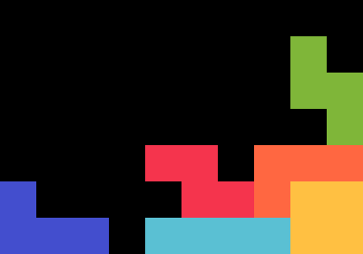
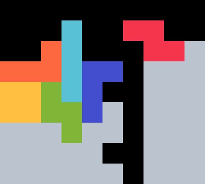
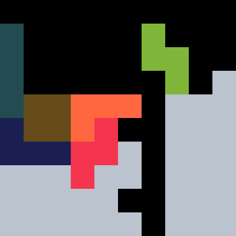
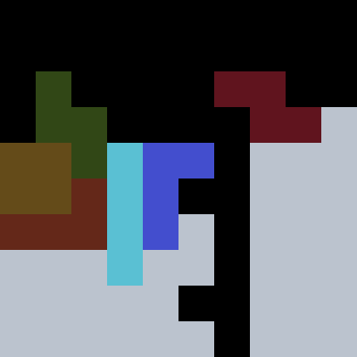

{width=200px}

# Scorpion <Badge type="warning" text="requires 180"/>

Scorpion is a reliable _TSS &rarr; TSS/TSM &rarr; 2xTST_ opener. It was discovered May 2023. 

## 1st Bag

{width=150px}

This can be stacked with $24.29 \%$ of bags. With the mirrored setup, the probability rises to $32.70 \%$. Generally, it can be built when $O$ comes early and $S$ comes late.

## 2nd Bag

{width=150px}

This can be stacked with $100 \%$ of bags while keeping B2B. The following setup allows either $S$ or $J$ to be placed after $T$:

{width=150px}

This bag also requires a *180 rotation* to be reliably stacked, as $L$ cannot otherwise be placed after $Z$ and $O$.

{width=90px}

## 3rd Bag

With the third bag the user can stack a full *2xTST* with $95.91 \%$ of bags. It is possible to raise the coverage to $97.46 \%$ by including donations, but we will ignore those solutions.

#### Early S solution

{width=150px}

This solution makes for clean stacking, so it should be checked for first.

#### L, S, Z solutions

{width=150px}

These solutions are easy to identify due to the dependency of placing $Z$ before $L$. The remaining pieces can be freestyled fairly easily, but fail when $I > J > O$ and $T > J$.

#### I, J solutions

{width=150px}

The remaining solutions are slightly harder to spot since only $I, J$ placements are fixed.

::: warning
3rd bag solutions are not so straightforward and should be practiced, especially if you are using Scorpion in VS.
:::
