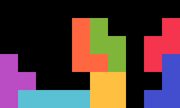
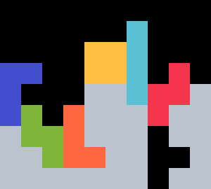
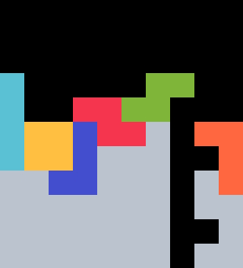
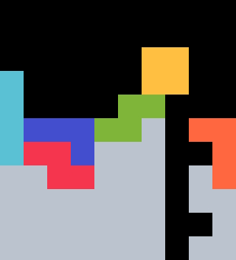

{width=200px}

# TL2 <Badge type="warning" text="requires 180"/>

TL2 is a reliable _TSD -> 2xTST Tower_ opener. It was discovered September 2024.

## 1st Bag {#bag-1}

{width=150px}

This shape can be stacked with $53.02 \%$ of bags. With the mirrored setup, the probability rises to $69.64 \%$.

## 2nd Bag {#bag-2}

{width=150px}

This shape can be stacked with any queue. For specific queues, either an $S$-tuck with rotations or an $L$-spin is needed, but not both.

  
  

## 3rd Bag {#bag-3}

The full *2xTST Tower* can always be stacked with the following builds.

  
  
  
  

