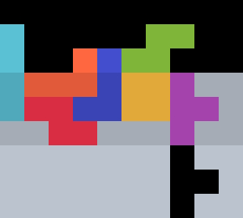

{width=200px}

# TLT

TLT is a well-rounded _TSD -> 2xTST Tower_ opener. It was discovered September 2024. 

## 1st Bag {#bag-1}

{width=150px}

This shape can be stacked with $57.46 \%$ of bags. With the mirrored setup, the probability rises to $76.94 \%$.

::: details
With mirror, TLT and [Cockroach](../cockroach/) cover all possible queues for the first bag.
:::

## 2nd Bag {#bag-2}

{width=150px}

This shape can be stacked with any queue. For specific queues, an $S$-tuck and/or a $Z$-tuck &ndash; both with rotations &ndash; is needed.

{width=150px}

## 3rd Bag {#bag-3}

The full *2xTST Tower* can always be stacked using one of the following builds.

  
  
  
  
  
  

## PC Looping (100%) <Badge type="warning" text="requires 180"/> {#looping}

With a few changes, TLT can be used as a *14L PC loop* opener.

### 3rd Bag {#loop-bag-3}

The third bag should be stacked into one of four builds:

  
  
  
  

With the t-spin, these builds cover $89.17 \%$ of queues, but we can always proceed with either of the first two builds if we allow skims.

### 4th Bag {#loop-bag-4}

The fourth bag can always be stacked in the following shape:

  
  
  
  

### 5th Bag PC {#loop-bag-5}

The PC can always be cleared with one of these 12 solutions. Refer to [this sheet](https://fumen.zui.jp/?D115@pgC8hlwwzhD8glxwAtRpD8glwwBtRpF8Ati0H8R4G8?R4g0JeAgWaAU+P9A5ngHBFbcRASEZ9ATLaHBQecRAylAAAp?gC8hlwwBth0D8glxwBtwhD8glwwRpg0whF8Rpg0whH8R4G8?R4whJeAAPaAz//DB4ngHBFbcRAS0OOBYUaHBQecRAylAAAp?gC8BtzhwwD8Btglg0xwD8ilg0RpF8h0RpH8R4G8R4wwJeAA?PaAS7P9AyngHBFbcRAS0+5ASIaHBQecRAylAAApgC8hlBtR?pwwD8glg0BtxwD8gli0Q4wwF8zhH8R4G8RpQ4JeAAPaAy53?5AxngHBFbcRAS0m2AWOaHBQecRAylAAApgC8hlwwBtRpD8g?lxwQ4RpD8glwwg0R4whF8i0whH8Q4whG8BtwhJeAAPaAS4f?2AwngHBFbcRAS0m2AQUaHBQecRAylAAApgC8BtR4i0D8Btz?hD8R4Rpwwg0F8RpxwH8wwglG8ilJeAAPZAREIOBzngHBFbc?RAS0YEB0mv2AUo78AZAAAApgC8BtR4hlwhD8Bth0glwhD8R?4g0wwglwhF8g0xwwhH8RpG8wwRpJeAAPZARBwKB3ngHBFbc?RASkWEBwmv2AUo78AZAAAApgC8BtR4whRpD8BtglwhRpD8R?4glwhh0F8hlg0wwH8xwG8whg0wwJeAAPZAx/XHB2ngHBFbc?RASU0RB0mv2AUo78AZAAAApgC8Bthlh0wwD8Btglg0xwD8z?hR4F8glR4wwH8RpG8g0RpJeAAPZAx8nABzngHBFbcRASEaO?Bymv2AUo78AZAAAApgC8BtR4glRpD8Bth0RpD8R4g0glwww?hF8g0xwwhH8wwwhG8hlwhJeAAApgC8BtR4i0D8BtRpwwg0D?8R4RpxwF8zhH8wwglG8ilJeAAPZAR7HOBwngHBFbcRASESE?Bwmv2AUo78AZAAAApgC8zhR4wwD8RpR4xwD8RpBthlF8i0g?lH8g0glG8BtwwJeAAPYAYlXOBFrnRASo78AYOb9AvfEEBwn?AVB) for probabilities of each solution.

  
  
  
  
  
  
  
  
  
  
  
  

